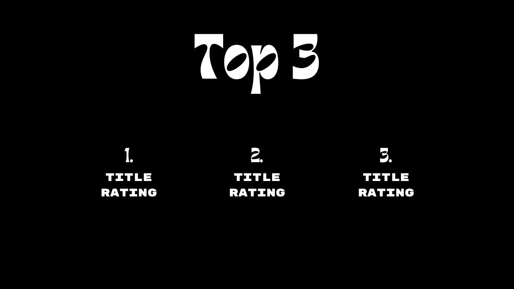
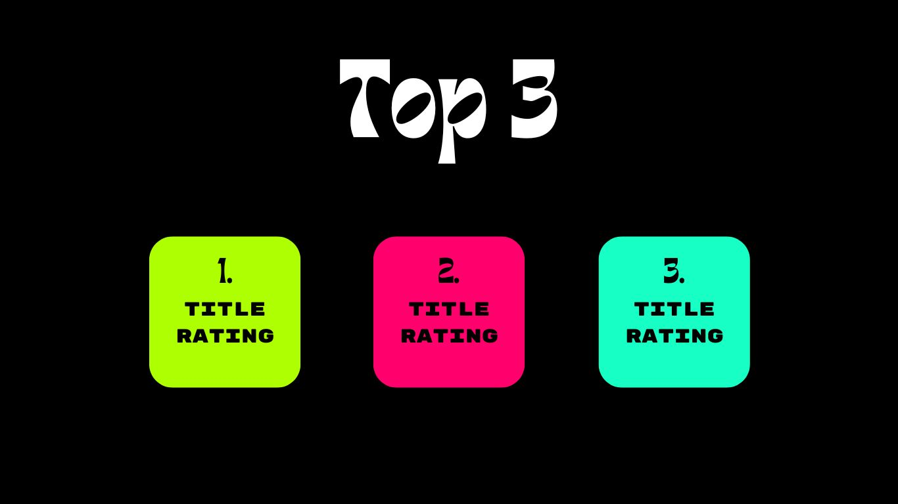

# Hackathon - Top 3

Dieses Projekt ist Aufgabe 3 aus dem Hackathon von [Kevin Chromik](https://www.youtube.com/@KevinChromik).

In diesem Projekt werde ich die Datebank / API von [OMDb](https://www.omdbapi.com/)
verwenden.

## Design

## Funktion

Der Nutzer wählt eine Kategorie aus und 
es werden die Top 3 Filme ausgegeben mit der
höchsten Bewertung.
Mir geht es in dem Projekt nicht um den 
größten Funktionsumfang, sondern um 
ein minimalistisches und ästhetisches Design.

## Tools
- Plain HTML,CSS und JavaScript
- Design wurde mit [Canva](https://www.canva.com/de_de/) erstellt
- Projetkmanagment mit [ToDoist](https://todoist.com/de)